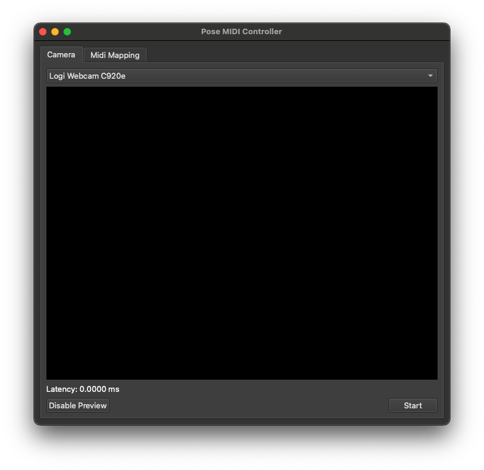
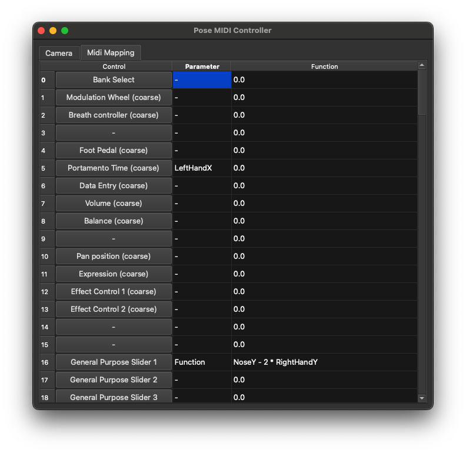

# Pose MIDI Controller

The Pose MIDI Controller is designed to transforms gestures or poses into MIDI signals in real-time.
The program provides a simple interface, getting you started on creatively turn physical expressions into acoustic feedback.

